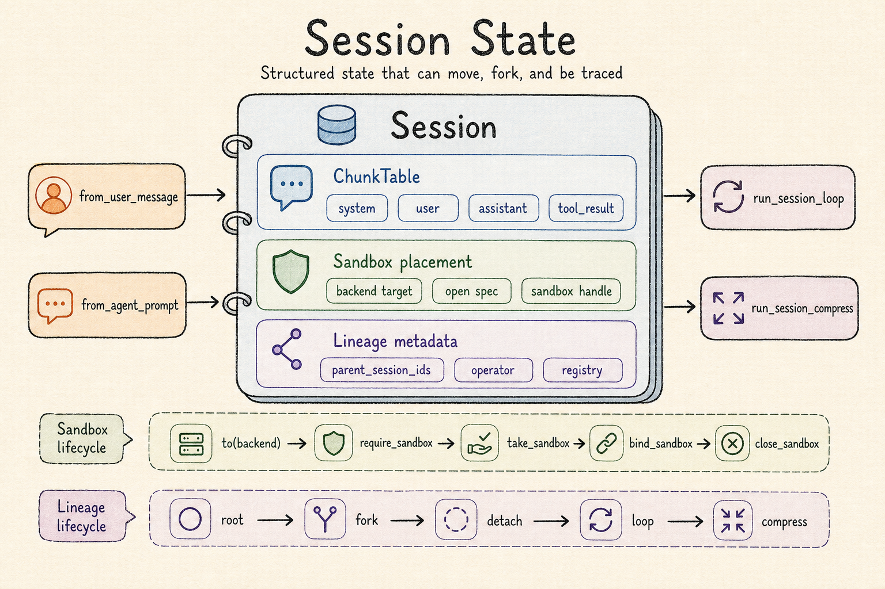
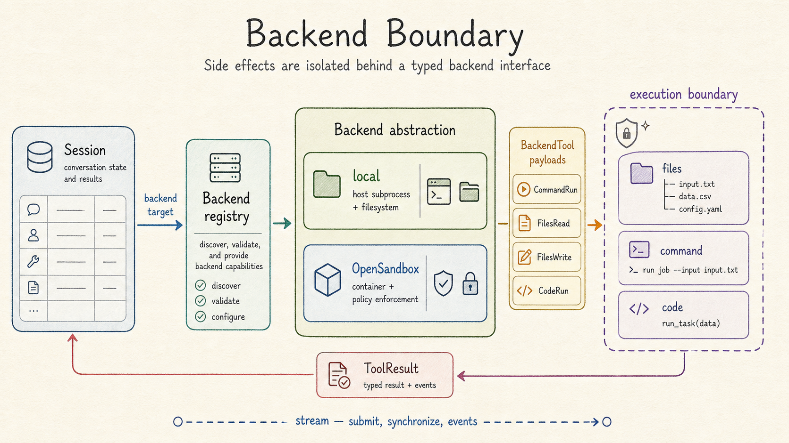
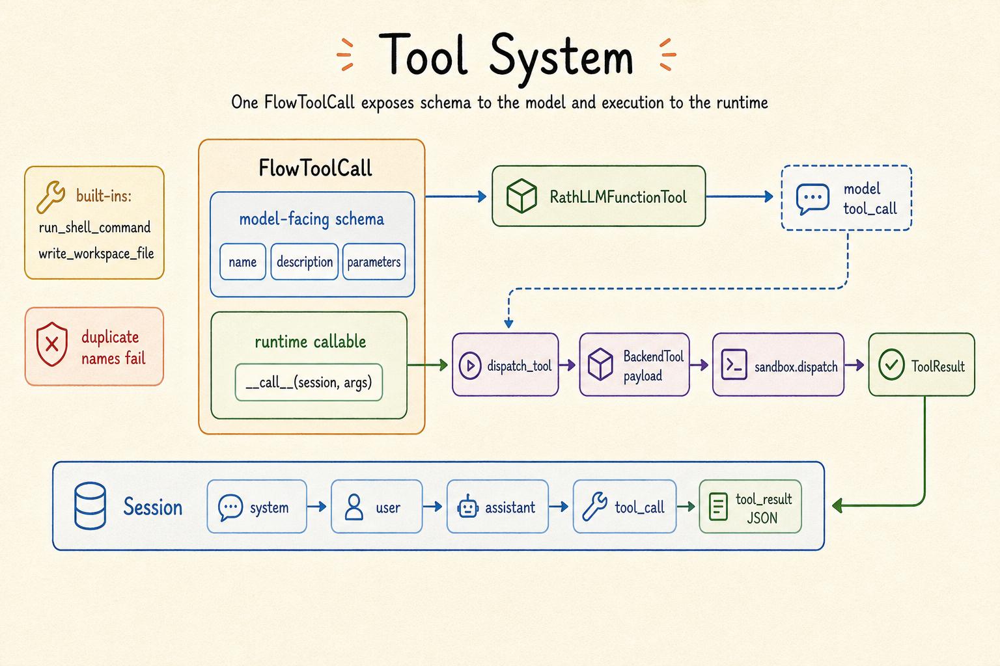
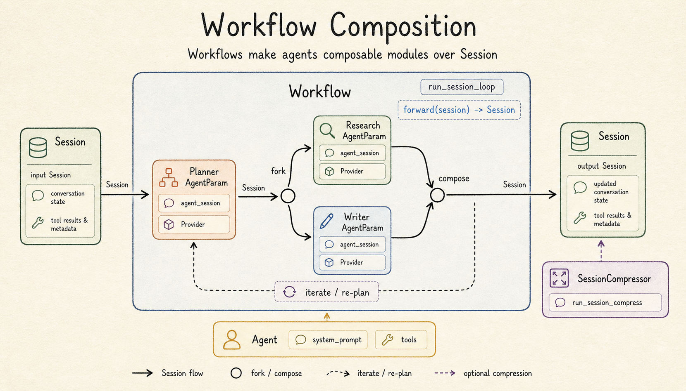
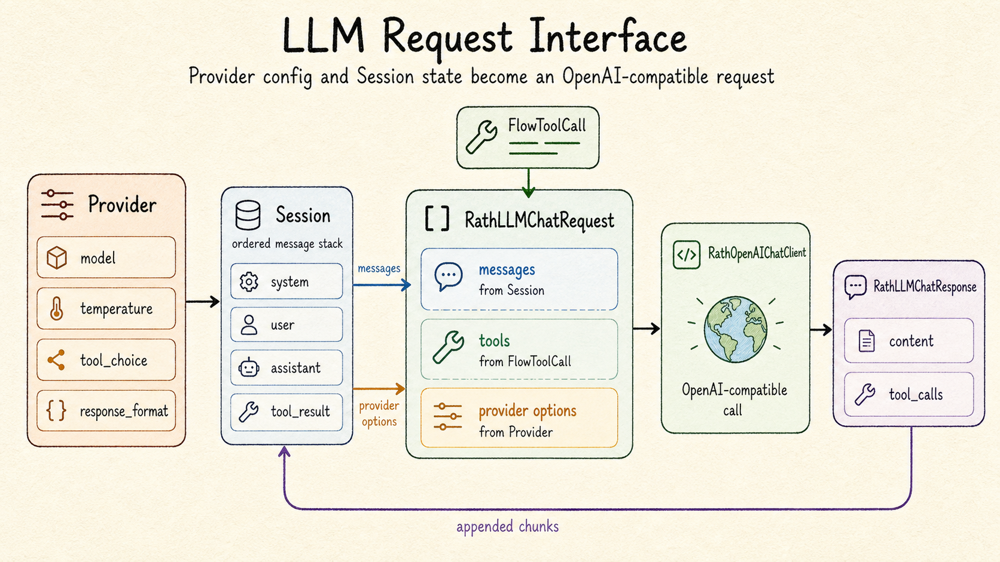

# OpenRath

Rath-Team/OpenRath is an open-source, torch-like API framework for dynamic
multi-agent workflows.

OpenRath keeps agent state in `Session`, runs tool payloads through sandbox
`Backend`s, and composes agents with `Workflow` and `AgentParam` APIs. The goal
is to make agent workflows feel like ordinary Python modules while keeping state,
tool execution, and model requests explicit.

## Install

```bash
git clone https://github.com/Rath-Team/OpenRath.git
cd OpenRath
pip install -e .
```

For development with `uv`:

```bash
uv sync --dev
```

For OpenSandbox support:

```bash
pip install -e ".[opensandbox]"
```

Create `.env` from `.env.example` and set:

```text
OPENAI_API_KEY=...
OPENAI_BASE_URL=https://api.openai.com/v1
OPENAI_DEFAULT_MODEL=...
```

## Minimal Session Loop

```python
import rath.flow as flow
from rath.session import Session, run_session_loop

agent_session = Session.from_agent_prompt("You are a concise assistant.")
user_session = Session.from_user_message("List this workspace and summarize it.")
user_session = user_session.to("local", spec="./")

out = run_session_loop(
    user_session=user_session,
    agent_session=agent_session,
    agent_provider=flow.Provider(model="gpt-5.5"),
)

print(out)
```

`run_session_loop` requires the user session to carry a sandbox target or handle.
Call `Session.to("local")`, `Session.to("opensandbox")`, or
`Session.with_sandbox(...)` before entering the loop.

## Core Highlights

### Session

`Session` stores the ordered conversation, tool results, backend placement, and
lineage metadata that make an agent run inspectable.



### Backend

`Backend` controls where execution happens. Local backends are useful for trusted
development loops; OpenSandbox backends isolate filesystem, command, and code
payloads behind policy boundaries.



### Tool

`FlowToolCall` separates model-facing JSON schemas from runtime execution. The
model sees a structured function contract; OpenRath invokes Python callables and
records typed results back into the session.



### Workflow

`Workflow` composes `AgentParam` objects and session transformations in normal
Python. A workflow receives a `Session`, delegates work, merges results, and
returns an updated `Session`.



### Provider

`Provider` carries OpenAI-compatible model and sampling options. Sessions provide
messages and tool definitions; providers configure how those requests are sent.



## Documentation

Build the local docs with:

```bash
bash scripts/build_docs.sh
```

The documentation starts at [`docs/source/index.md`](docs/source/index.md).
Runnable examples live under [`example/`](example/):

| Example | What it demonstrates |
| --- | --- |
| `session_usage.py` | Session loop and compression. |
| `custom_tool_usage.py` | User-defined `FlowToolCall`. |
| `sandbox_backend_local.py` | Local backend workspace binding. |
| `sandbox_backend_opensandbox.py` | OpenSandbox backend binding. |
| `trading_agents/` | Sequential multi-agent research workflow with a market-data tool. |
| `engineering_agents/` | Nested engineering workflow with lead, squad, backend pair, and QA roles. |
| `research_transformer/` on `main` | Transformer-metaphor academic pipeline with branch workflows, compression, per-role providers, and an optional image tool. |

## Current Scope

OpenRath currently provides:

- local process sandbox backend;
- optional OpenSandbox backend;
- typed backend tool payloads and results;
- OpenAI-compatible synchronous chat client;
- blocking session loop with tool rounds;
- `Workflow`, `AgentParam`, `Agent`, and `SessionCompressor`;
- session lineage helpers for debugging and provenance.

The API is still early. Prefer reading the documentation and examples before
treating any internal module as stable.
