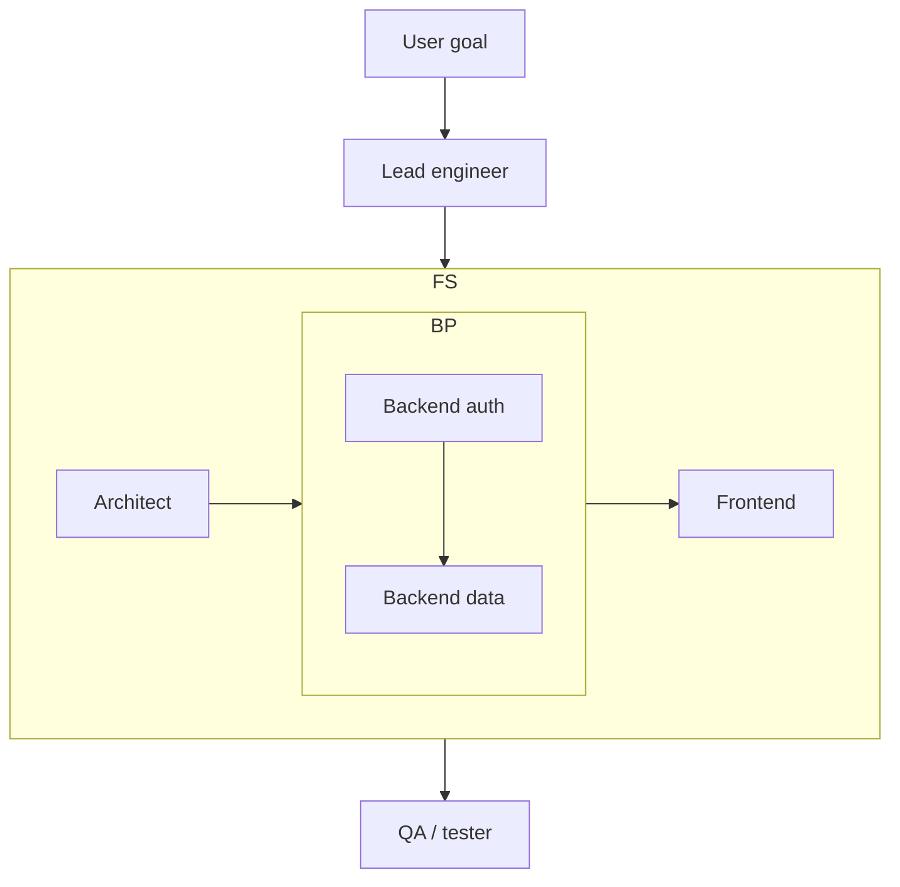

# Engineering Agents

A **nested multi-agent software engineering** example inspired by team-style agentic development: a **lead engineer** plans, a **feature squad** (architect → backend pair → frontend) implements, and a **QA** pass reviews the result. Each phase is a `run_session_loop` with its own agent session and shared user-facing history.

## When to use this example

- You want a **readable hierarchical workflow**: outer project orchestration with an inner `Workflow` for backend auth → data → frontend.
- You are comparing OpenRath’s **`Workflow.forward`** composition with “squad” patterns from other agent frameworks.
- You need a **minimal CLI** that only requires a single OpenAI-compatible provider and a goal string.

## Prerequisites

- Python 3.10+ and [`uv`](https://github.com/astral-sh/uv).
- `OPENAI_API_KEY` in the environment (the CLI exits early if it is missing).

## Environment variables

| Variable | Required | Purpose |
|----------|----------|---------|
| `OPENAI_API_KEY` | Yes | API key for all agents in this example. |
| `OPENAI_BASE_URL` | No | Alternate OpenAI-compatible endpoint. |
| `OPENAI_DEFAULT_MODEL` | No | Model name; omit for provider default. |

## Architecture



- **Lead** (`LEAD_ENGINEER_SYSTEM`): breaks down the goal and sets direction.
- **Feature squad**: **Architect** → **BackendPairWorkflow** (auth agent, then data agent) → **Frontend** agent.
- **QA** (`QA_SYSTEM`): post-implementation review; no extra tools are registered in this example (pure LLM reasoning).

All stages run against the **local backend** with a configurable working directory for sandboxed file/command tools if you extend the prompts later.

## How to run

From the repository `example/` directory:

```bash
export OPENAI_API_KEY=sk-...
# optional:
# export OPENAI_BASE_URL=https://api.openai.com/v1
# export OPENAI_DEFAULT_MODEL=gpt-4o

uv run python engineering_agents/main.py \
  --goal "Full-stack todo app with auth, SQLite, and a React frontend."
```

### Flags

| Flag | Meaning |
|------|---------|
| `--workdir` | Local sandbox root (default: `.workspace/` relative to CWD; resolved to absolute). |
| `--print-chunks` | One brief line per newly appended session chunk (verbose tracing). |

## Extending the demo

- Add **tools** to specific `run_session_loop` calls in `workflows.py` (e.g. filesystem or shell) to turn this into an executable codebase generator.
- Swap **system prompts** in `agents.py` to match your team’s review gates or tech stack.

## Related code

- `main.py` — argparse entrypoint and provider construction.
- `workflows.py` — `EngineeringProjectWorkflow`, `FeatureSquadWorkflow`, `BackendPairWorkflow`, `QualityAssuranceWorkflow`.
- `agents.py` — system prompt strings for each role.

## License

Follows the same license as the parent OpenRath project.

## Documentation note

These examples are documented like reusable agent skills: explicit **when-to-use** triggers, environment tables, and runnable commands. For curated SKILL.md collections and IDE install paths, see [best-skills](https://github.com/xstongxue/best-skills) and the [Cursor Skills documentation](https://cursor.com/docs/context/skills).
