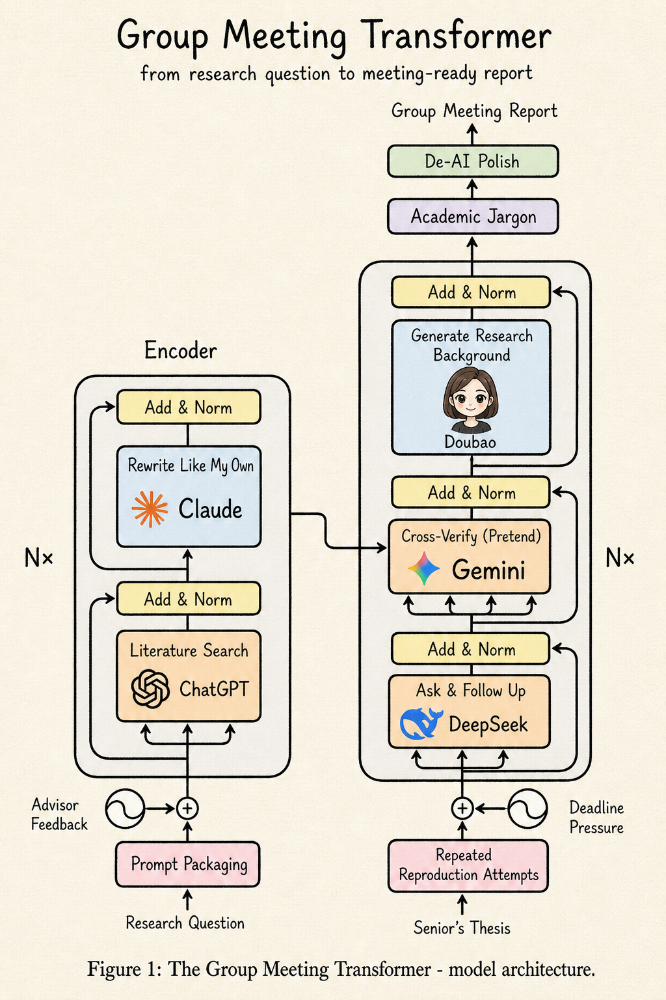

# Research Transformer

A multi-stage **academic pipeline** example for OpenRath. It models a “transformer-like” stack: two parallel branches (literature synthesis and thesis reproduction), **session compression** between major stages, then an output head that tightens register and polishes prose. Each station can use a **different model** via environment variables.

<div align="center">
  
</div>

## When to use this example

- You want to see **nested workflows**, **per-role providers**, and **`run_session_compress`** wired end-to-end.
- You are prototyping **research-to-writing** flows with advisor constraints, a thesis excerpt, and optional **background image** tools.
- You need a template for **Claude/Codex/Cursor-style** “skills” documentation: clear triggers, env surface, and CLI.

## Prerequisites

- Python 3.10+ and [`uv`](https://github.com/astral-sh/uv) (or your usual OpenRath dev setup).
- An **OpenAI-compatible API** key (OpenAI or any compatible gateway).
- A UTF-8 **thesis excerpt file** (plain text) for the reproduction branch.

## Environment variables

| Variable | Required | Purpose |
|----------|----------|---------|
| `OPENAI_API_KEY` or `RESEARCH_TRANSFORMER_API_KEY` | Yes | API key for all roles unless you split keys later. |
| `OPENAI_BASE_URL` or `RESEARCH_TRANSFORMER_BASE_URL` | No | Custom base URL for OpenAI-compatible APIs. |
| `OPENAI_DEFAULT_MODEL` | No | Fallback model when a role-specific model is unset. |
| `RESEARCH_TRANSFORMER_MODEL_*` | No | Override model per station (see below). |
| `ZHIPU_API_KEY` | No | Optional: enables `background_image` (BigModel GLM-Image). `OPENAI_API_KEY` can be used as a fallback key source for that tool only if Zhipu is not set—see `tools.py`. |

Per-role model overrides (each falls back to `OPENAI_DEFAULT_MODEL`):

| Env suffix | Role |
|------------|------|
| `MODEL_PACKAGER` | Literature branch: framing / packaging |
| `MODEL_LITERATURE` | Literature search & synthesis turns |
| `MODEL_REWRITE` | Rewrite / refinement |
| `MODEL_QA` | Reproduction branch: Q&A on thesis |
| `MODEL_VERIFIER` | Verification (may use image tools) |
| `MODEL_JARGON` | Output head: academic register |
| `MODEL_DEAI` | Output head: de-AI / style polish |
| `MODEL_COMPRESSOR` | Session compression between major stages |

## How to run

From the repository `example/` directory (so sibling imports like `_chunk_print` resolve):

```bash
uv run python research_transformer/main.py \
  --research-question "Your main question" \
  --supervisor-notes "Constraints, tone, must-cite work, etc." \
  --thesis-path ./path/to/thesis_excerpt.txt
```

### Useful flags

| Flag | Meaning |
|------|---------|
| `--workdir` | Sandbox root (default: `research_transformer/.workspace/`). |
| `--layers` / `--iterations` | Repeat depth per branch (default: 2). |
| `--ddl-note` | Free-text pressure / deadline context for the reproduction branch. |
| `--skip-images` | Do not register optional `background_image` tool. |
| `--no-compress` | Disable compression between major stages (context may grow quickly). |
| `--print-chunks` | Print one brief line per new chunk (loop, compress, preamble). |

## Outputs and observability

- The **returned session** is the final `Session` after the output head; extend `main.py` if you want to persist chunk tables or export Markdown.
- **`--print-chunks`** uses the shared example hook that respects UTF-8 on the console when possible.

## Related code

- `workflow.py` — workflow graph and compression points.
- `providers.py` — environment-based `ResearchTransformerProviders`.
- `prompts.py` — system prompts per agent.
- `tools.py` — optional BigModel-backed `background_image` tool.

## License

Follows the same license as the parent OpenRath project.

## Documentation note

These examples are documented like reusable agent skills: explicit **when-to-use** triggers, environment tables, and runnable commands. For curated SKILL.md collections and IDE install paths, see [best-skills](https://github.com/xstongxue/best-skills) and the [Cursor Skills documentation](https://cursor.com/docs/context/skills).
